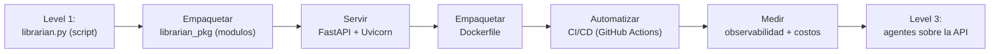
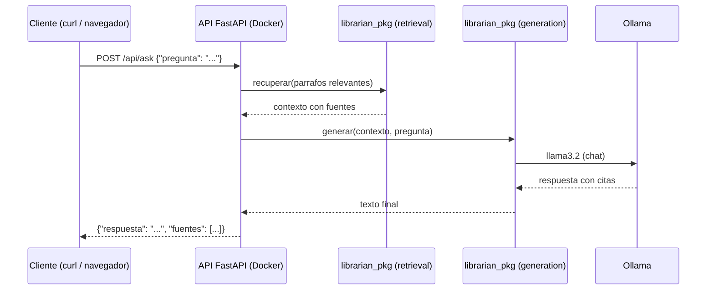

# Level 2 — AI Systems Deployment

> **TL;DR:** Este nivel separa demos de sistemas reales. Vamos a tomar el `librarian` de Level 1 y ponerlo en producción: empaquetarlo en un contenedor Docker, exponerlo como una API FastAPI, automatizar el despliegue con CI/CD (GitHub Actions) y medir latencia, tokens y costos. Al final tendremos un servicio al que se le habla por HTTP, que se despliega con un comando y que reporta cómo funciona.

---

## 0. Donde estas en el roadmap

| Nivel | Dominio | Herramientas | Que haces |
|-------|---------|-------------|-----------|
| 0 | Fundamentos Software & IA | Python, HuggingFace, pytest | Escribir codigo Python solido y entender fundamentos de DL |
| 1 | LLM Engineering | Ollama, OpenCode Go, ChromaDB, tiktoken | Llamar APIs, prompts, embeddings y RAG |
| **2** | **AI Systems Deployment** | **Docker, FastAPI, CI/CD, Terraform** | **Poner modelos en produccion** |
| 3 | Agentic AI | CrewAI, LangGraph, MCP | Agentes multi-agente |
| 4 | Model Ops | Unsloth, vLLM | Fine-tuning y optimizacion |
| 5 | Infra & Production | Airflow, K8s, Prometheus | Sistemas IA escalables |

En Level 1 construimos `librarian`, un asistente RAG que responde preguntas con citas. Pero corria como un **script de terminal**: alguien lo ejecuta, ve la respuesta y se acabó. Ahora viene el salto que separa a un ingeniero junior de uno de produccion: **convertir ese script en un servicio**.

> **Nota:** este nivel es el puente entre la academia y la industria. Todo lo que hace un equipo real de IA (empaquetar, servir, probar, desplegar, medir) lo vamos a hacer con nuestras propias manos.

---

## 1. Que vas a construir en este nivel

Al terminar Level 2, habremos creado esta estructura dentro de nuestro Codespace:

```text
level-2/
├── requirements.txt            # Dependencias del nivel
├── data/
│   └── knowledge_base.md       # La KB de Level 1 (copiada)
├── labs/
│   ├── librarian_pkg/          # librarian como paquete Python
│   │   ├── __init__.py
│   │   ├── kb.py               # Cargar e indexar la KB
│   │   ├── retrieval.py        # Buscar parrafos relevantes
│   │   └── generation.py       # Generar respuesta con el LLM
│   ├── api_main.py             # La API FastAPI
│   ├── models.py               # Modelos Pydantic (request/response)
│   ├── Dockerfile              # Empaquetado del servicio
│   ├── docker-compose.yml      # Orquestacion
│   ├── test_api.py             # Tests de la API
│   ├── .github/workflows/ci.yml  # CI/CD
│   ├── metrics.py              # Observabilidad basica
│   └── cost_report.py          # Costos por request
```

Cada section te guia paso a paso para crear UNO de esos archivos, igual que en Level 1.

> **Plataforma vs infraestructura ad-hoc:** el `docker-compose.yml` de la
> raiz (`student-ai/`) es la **plataforma** del programa (ollama, postgres,
> jupyter): ya viene en el repo, no se crea. Los `Dockerfile` y
> `docker-compose.yml` dentro de `labs/` son la **infra ad-hoc del nivel**:
> se crean en las sections 5-6 para empaquetar y orquestar la API. En el
> Level 5, esta API pasa a la infraestructura central de `ai-platform/`.

---

## 2. El viaje: de script a producto

Este es el corazon del nivel. La progresion que vamos a vivir:



Cada paso transforma el sistema un poco mas hacia "producto":

| Paso | Que cambia | Por que importa |
|------|-----------|-----------------|
| **Empaquetar** | De un script a modulos reutilizables | El codigo se puede importar, probar y crecer |
| **Servir** | De terminal a API HTTP | Cualquier cliente (web, movil, otro servicio) puede hablarle |
| **Contenedor** | De entorno local a imagen reproducible | Corre igual en cualquier maquina |
| **CI/CD** | De despliegue manual a automatico | Cada cambio se prueba y se publica solo |
| **Medir** | De "funciona" a "sabemos como funciona" | Latencia, tokens y costos por request |

> **En lenguaje llano:** en Level 1 aprendimos a *hacer* que un modelo responda. En Level 2 aprendemos a *entregar* ese modelo como un servicio que cualquiera puede usar, que se actualiza solo y del que sabemos cuanto cuesta.

---

## 3. El stack del nivel

| Herramienta | Que es | Para que la usas |
|-------------|--------|-------------------|
| **FastAPI** | Framework web Python para APIs | Crear los endpoints del servicio |
| **Uvicorn** | Servidor ASGI (corre la API) | Escuchar peticiones HTTP |
| **Pydantic** | Validacion de datos con type hints | Definir request/response tipados |
| **Docker** | Contenedores reproducibles | Empaquetar el servicio con sus dependencias |
| **Docker Compose** | Orquestar multiples contenedores | Levantar API + dependencias juntas |
| **pytest** | Framework de testing | Probar que la API funciona |
| **GitHub Actions** | CI/CD de GitHub | Test + build + push automaticos |

> **Nota sobre infra:** el stack de Docker/FastAPI/uvicorn/pytest corre todo en nuestro Codespace. GitHub Actions corre en los servidores de GitHub cuando hacemos push. Terraform aparece en el roadmap como concepto de infraestructura declarativa (nivel 5), pero en este nivel no se crea: el foco es empaquetar con Docker y automatizar con CI/CD.

---

## 4. Que vas a lograr

Al final del nivel, este es el flujo que va a funcionar de verdad:



Ese mismo flujo, que en Level 1 era un script, ahora es un servicio al que se le habla por HTTP y que se despliega con Docker.

---

## 5. Prerrequisitos

Para este nivel necesitas:

- El Codespace de Level 1 funcionando (Python 3.12, `.venv` activo)
- **Docker** corriendo (ya viene instalado en el Codespace)
- El `librarian.py` y la `knowledge_base.md` de Level 1 (los vamos a reutilizar)
- Ollama corriendo con `llama3.2` (Level 1 ya lo configuro)
- Git y GitHub (los labs de CI/CD corren en nuestro fork de `student-ai`)

> **Nota:** la seccion 7 (tests) y la 8 (CI/CD) necesitan que el repo del alumno este conectado a GitHub. En un Codespace ya esta listo; solo hay que hacer push al fork propio.

---

## 6. Errores comunes de criterio

| Error | Por que esta mal |
|-------|------------------|
| "Mi script funciona, no necesito una API" | Un script lo usa una persona; una API lo usan sistemas. La diferencia es el alcance |
| "Docker es solo para servidores" | Docker tambien reproduce el entorno local: misma version de Python, mismas dependencias |
| "El CI/CD es para equipos grandes" | Un CI que corre nuestros tests antes de romper produccion nos ahorra horas aun en proyectos chicos |
| "Con que funcione alcanza" | En produccion hay que saber latencia, tokens y costo. Si no se mide, no se puede operar |

---

## 7. Resumen de la seccion

- Este nivel convierte `librarian` (script) en un servicio de produccion
- La progresion: empaquetar → servir → contenedor → CI/CD → medir
- El stack: FastAPI, Uvicorn, Pydantic, Docker, Docker Compose, pytest, GitHub Actions
- Todo corre en el Codespace salvo GitHub Actions (servidores de GitHub)

---

## 8. Checklist de cierre

Antes de pasar a la Section 1, verifica:

- [ ] Entendiste la diferencia entre script y servicio
- [ ] Identificas los 5 pasos de la progresion demo → producto
- [ ] Sabes que este nivel reutiliza el `librarian` de Level 1
- [ ] Distingues que corren en el Codespace (FastAPI, Docker, pytest) vs en la nube (GitHub Actions)

---

## Siguiente paso

En la **Seccion 1** vamos a reestructurar `librarian.py` en un paquete Python con modulos separados (`kb.py`, `retrieval.py`, `generation.py`). Es el primer paso del viaje: de script a codigo que se puede importar y probar.
